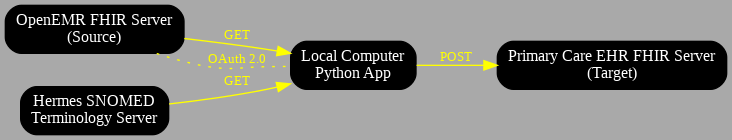

Home Page

[Home](./index.md) ||
[BPMN Model](./bpmn.md) ||
[Use Case Model](./use_case.md) ||
[ETL Pipeline](./etl_pipeline.md) ||
[Insights](./insights.md) ||
[Team Contributions](./team_contrib.md) ||
[About](./about.md) ||

## ETL Project Documentation
PROJECT OVERVIEW

Introduction 

Our project focuses on designing and implementing an ETL (Extract, Transform, Load) pipeline to streamline healthcare data exchange between systems using modern interoperability standards. The project emphasizes the integration of healthcare data from multiple sources, ensuring accurate and efficient data processing to support clinical workflows and decision-making.

## The purpose of the ETL pipeline

The ETL pipeline is designed to extract data from various sources, transform it into a consistent and usable format, and load it into a target system. This pipeline supports seamless data integration, enabling healthcare providers to access, analyze, and act on valuable patient data. It's primary goal is to facilitate efficient interoperability between systems while ensuring data accuracy and reliability for better decision-making and improved patient outcomes.

## The key tools and technologies used

Our project uses a combination of modern tools and technologies to implement the ETL pipeline effectively:

Python: We used python for scripting the ETL pipeline, managing API connections, and handling data transformation tasks with precision.

FHIR API: To ensure structured and interoperable data exchange across healthcare systems.

Hermes Terminology Server: For accessing standardized medical terminologies, such as SNOMED codes, to enhance data consistency.

OpenEMR FHIR Server: As the primary data source for extracting and managing patient information and conditions.

GitHub Pages: To host a professional project website, presenting the pipeline, documentation, diagrams, and visualizations.

## Summary of the deliverables

ETL Pipeline: A fully functional pipeline that extracts data from different sources, transforms it into a consistent format, and loads it into a target system. 

Python Scripts: Four Python tasks that showcase essential ETL functions:
Retrieving parent and child medical terms using FHIR APIs and SNOMED codes.
Creating and managing patient information, including conditions, observations, and procedures.

GitHub repository :  A well-organized repository containing the project’s code, documentation, and resources, with clear instructions for running the scripts.

Professional GitHub Pages Website: A project website documenting every aspect of the ETL pipeline. This includes:

An overview of the project.
BPMN and use case diagrams.
Detailed technical documentation of the pipeline.
Individual and team contributions.
Reflections on challenges, insights, and lessons learned.

Insights and Visualizations:
Important findings from processed medical data that are presented in an understandable manner. These observations highlight the ETL pipeline's importance in identifying trends and facilitating data-driven decisions in medical environments.
