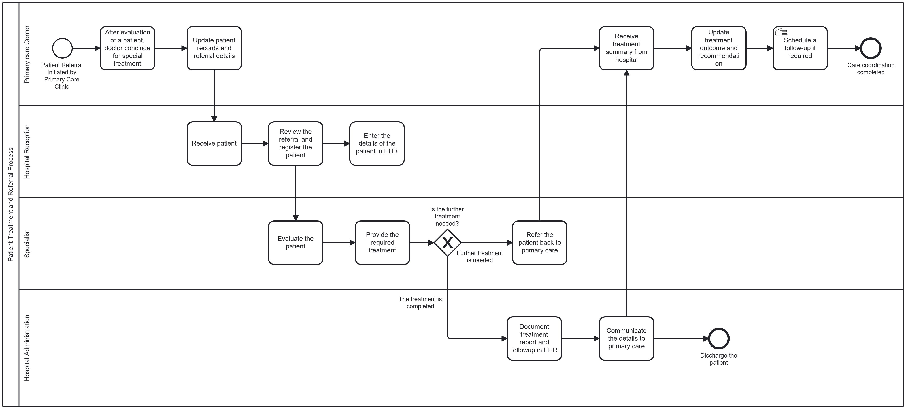

# Insights page

[Home](./index.md) ||
[BPMN Model](./bpmn.md) ||
[Use Case Model](./use_case.md) ||
[ETL Pipeline](./etl_pipeline.md) ||
[Insights](./insights.md) ||
[Team Contributions](./team_contrib.md) ||
[About](./about.md) ||

## Key insights gained from the project:

Data Volume and Clinical Value: The OpenEMR FHIR API contains a significant volume of patient data, offering a rich source of information for clinical analysis and health trend insights.

Enhanced Interoperability: Integrating this data with the Hermes Terminology Server, and utilizing SNOMED CT parent-child mappings, helped structure the data more effectively, improving interoperability and clinical value.

## Challenges Encountered :

API Complexities 

Using Extensions for Hermes Terminology Server Links:  Identifying and correctly applying extensions for the Hermes Terminology Server links proved to be difficult.  The links for parent and child term was separate which was rectified during the projects with the help from professor. 

Data Inconsistencies:

Empty Fields in Primary Care EHR System:  During the data transfer from OpenEMR, we encountered empty fields in the Primary Care EHR system.

Data Compatibility Challenges:

SNOMED CT Values and String Input: In Task 2, SNOMED CT values required string inputs, but the data initially had numerical values.  We made adjustments to ensure compatibility and proper processing of the data by converting numerical values into string inputs.

## Lessons Learned

ETL Pipeline Demonstration: A valuable demonstration for professional use involves querying and posting data to an API server using a single key, such as a patient ID or name. This demonstrates how data can be extracted and updated in real-time, making it relevant for day-to-day professional tasks.

## Potential Improvements

Incorporate Automation and AI: Using machine learning algorithms for tasks like data validation, anomaly detection, or predictive analysis might significantly improve data accuracy and produce outcomes that are more insightful.

User-Centric Design: By adding features that place the user's experience first, including simple user interfaces or improved error reporting, the pipeline would be more useful in the real world.