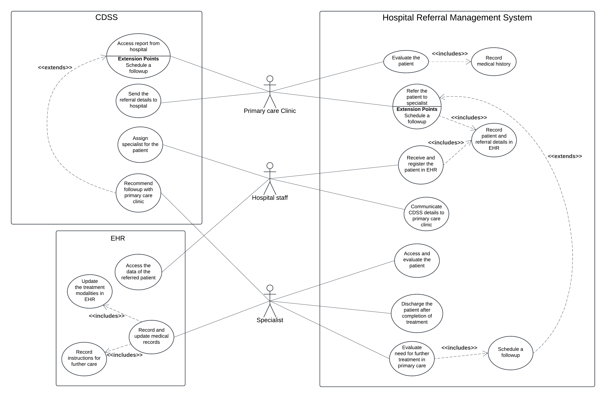

# Use Case page

  Use case diagrams illustrate the interactions between users and a system, highlighting key processes and roles. This page showcases a use case for the Hospital Referral Management System, demonstrating how primary care clinics, hospitals, and specialists collaborate to manage referrals, make treatment decisions, and ensure effective communication for seamless patient care.

[Home](./index.md) ||
[BPMN Model](./bpmn.md) ||
[Use Case Model](./use_case.md) ||
[ETL Pipeline](./etl_pipeline.md) ||
[Insights](./insights.md) ||
[Team Contributions](./team_contrib.md) ||
[About](./about.md) ||

### Hospital Referral Management System

The use case diagram depicts the interactions among key actors within the Hospital Referral Management System: **Primary Care Clinic**, **Hospital Staff**, and **Specialist**. Each actor plays a vital role in ensuring smooth patient referrals, effective treatment, and coordinated communication. The **Primary Care Clinic** initiates the process by referring patients to the hospital, documenting relevant patient details, and sending the information to the hospital. The **Hospital Staff** handle receiving and registering the patient, entering the data into the Electronic Health Record (EHR), and coordinating communication between the hospital, Clinical Decision Support System (CDSS), and the Primary Care Clinic. The **Specialist** evaluates the patient, provides treatment, and makes informed decisions regarding follow-up or discharge based on the patient’s condition and CDSS recommendations.

The **CDSS** plays a critical role in enhancing the decision-making process by analyzing patient data stored in the EHR and providing actionable recommendations. It guides the Specialist by suggesting whether the patient requires further treatment and follow-up care at the Primary Care Clinic or can be discharged. This ensures that decisions are evidence-based, improving the accuracy and efficiency of patient management. The use cases depicted in the diagram include managing patient referrals, recording and updating patient information in the EHR, and leveraging CDSS for clinical decision-making. Communication is a central component, ensuring treatment details and follow-up recommendations are effectively relayed back to the Primary Care Clinic to maintain continuity of care. This collaborative workflow highlights the importance of CDSS in supporting accurate decision-making, streamlining processes, and improving patient outcomes while enhancing care coordination across stakeholders.
